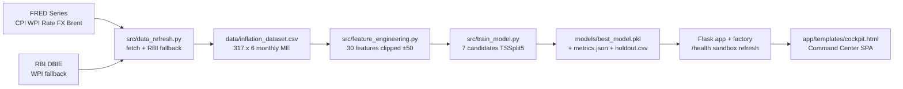
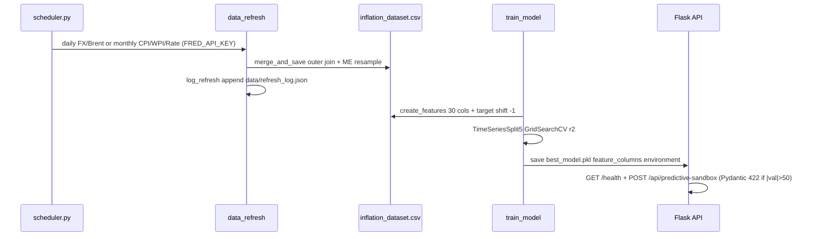

# VaticMacro

## Indian CPI Inflation Forecasting

VaticMacro forecasts Indian Year-over-Year CPI inflation one month ahead from five macro indicators. It uses a monthly panel (2000-2026, 317 observations) with 30 engineered features and a regularized linear model that outperforms a naive baseline on an out-of-sample holdout.

Designed for policy teams, researchers, investors, and students who need reproducible inflation estimates for the Indian economy.

---

## System Overview





---

## Problem and Solution

Inflation reflects purchasing power, rates, and policy space. Predicting it is hard because it depends on linked factors: CPI level, wholesale prices, policy rates, exchange rates, and energy prices. Levels drift across decades, daily forward-fills create false confidence, and small samples overfit tree models.

VaticMacro addresses this with:
- Monthly truth without duplication (no daily forward-fill)
- Scale-stationary features (YoY and MoM percent changes, ratios)
- Autoregressive lags as the main signal (lag-1 autocorr > 0.99)
- Time-series validation without leakage (`TimeSeriesSplit`, holdout 2024-07 onward)
- A single deployable artifact with environment provenance

---

## Dataset

**File:** `data/inflation_dataset.csv` — 317 monthly rows, 2000-01-31 to 2026-05-31, 6 columns. Validated by `src/schemas.py` (pandera) and `src/config.py` (frozen `SETTINGS`).

| Column | Meaning | Source | Frequency |
|---|---|---|---|
| `Date` | Month end | — | Monthly |
| `INDCPIALLMINMEI` | Consumer Price Index (2015=100), YoY target | FRED | Monthly |
| `WPIATT01INM661N` | Wholesale Price Index industry | FRED + RBI DBIE fallback | Monthly |
| `INTDSRINM193N` | RBI repo rate | FRED | Monthly |
| `DEXINUS` | USD/INR | FRED | Daily → `ME` |
| `Average of DCOILBRENTEU` | Brent ICE USD/barrel | FRED | Daily → `ME` |

Target is not stored: `inflation_yoy = (CPI_t - CPI_{t-12}) / CPI_{t-12} * 100`, `target_future = current_yoy.shift(-1)`.

Refresh: `src/data_refresh.py` `fetch_all_sources(cadence)` with daily (FX/Brent) and monthly (CPI/WPI/Rate) cadence via `src/scheduler.py`; logs to `data/refresh_log.json`. RBI fallback `fetch_rbi_dbie_series` never raises. See `docs/DATA_DICTIONARY.md` for full dictionary and merge steps.

**Engineered features:** 30 columns from `src/feature_engineering.py:FEATURE_COLUMNS` — calendar sin/cos, 7 AR lags + acceleration, MoM/YoY and 6-month rolling for each of WPI/Rate/FX/Brent, plus `WPI_CPI_ratio`, `oil_inr_ratio`, spreads and volatility. All pct/lag columns clipped `±50`. Output is about 293 × 32 after `dropna`. See `docs/DATA_DICTIONARY.md#engineered-features`.

---

## Model and Benchmarks

Seven candidates run the same pipeline `VarianceThreshold → SelectKBest → RobustScaler → estimator` with `GridSearchCV` on `r2`:

- Ridge, Ridge with mutual information, ElasticNet, Ridge with polynomial features, Random Forest, XGBoost, LightGBM

Ridge wins on 216 training months. Artifact: `models/best_model.pkl` `{pipeline, feature_columns, model_name, environment}` + `models/metrics.json` + `models/holdout.csv` (22 rows 2024-07 → 2026-05). Helpers `compute_metrics` and `naive_baseline_mae` in `src/train_model.py` are the single source for scores.

### Results (2026-09-14, `benchmarks/`)

| Benchmark | Metric | Result | Threshold | Status |
|---|---|---|---|---|
| `bench_holdout.py` | CV R² (Ridge, 5-fold TSSplit) | 0.588 | — | — |
| `bench_holdout.py` | Holdout R² | 0.543 | > 0.30 | Pass |
| `bench_holdout.py` | Holdout MAE | 0.556 | < naive 0.654 | Pass |
| `bench_holdout.py` | Holdout RMSE | 0.738 | — | — |
| `bench_holdout.py` | Naive persistence MAE | 0.654 | — | — |
| `bench_cv.py` | `create_features` 293 rows × 32 cols | 20.5 ms | < 250 ms | Pass |
| `bench_latency.py` | Predictive sandbox p50 | 0.2 ms | — | — |
| `bench_latency.py` | Predictive sandbox p95 | 49.0 ms | < 100 ms | Pass |

Evaluation uses `MAE`, `RMSE`, `R²`. Full reproduction steps and per-model CV table in `docs/BENCHMARKS.md`.

---

## Project Structure

```text
VaticMacro/
├── app/
│   ├── factory.py              # create_app — /health + POST /api/predictive-sandbox (Pydantic, 422 if |val|>50)
│   ├── blueprints/             # health/api/views
│   ├── services/schemas.py     # SandboxRequest
│   └── templates/cockpit.html  # hash-router SPA, Chart.js, a11y skip-link + prefers-reduced-motion
├── src/
│   ├── config.py               # frozen SETTINGS (COLUMN_MAP, paths)
│   ├── schemas.py              # pandera InflationDatasetSchema
│   ├── preprocessing.py        # heterogeneous CSV → observation_date + ME resample
│   ├── feature_engineering.py  # 30 FEATURE_COLUMNS, clipping
│   ├── train_model.py          # 7 candidates, compute_metrics, capture_environment
│   ├── data_refresh.py         # FRED fetch + RBI fallback, merge_and_save, log_refresh
│   └── scheduler.py            # cadence runner
├── benchmarks/                 # bench_holdout / bench_cv / bench_latency
├── tests/                      # unit + contracts + integration (42 tests, 92.7% coverage, gate 80%)
├── data/inflation_dataset.csv  # 317×6 monthly truth
├── models/                     # best_model.pkl, metrics.json, holdout.csv + per-model pkl
├── docs/                       # ARCHITECTURE, DATA_DICTIONARY, BENCHMARKS, GETTING_STARTED
├── pyproject.toml              # Python 3.12, single source deps
├── requirements-strict.txt     # pinned 15 libs
├── Dockerfile + docker-compose.yml + render.yaml  # 3.12-slim non-root, HEALTHCHECK :10000/health
└── app.py / merge_data.py / run_train.py  # legacy entrypoints
```

Detailed architecture, dependencies, and routes in `docs/ARCHITECTURE.md`.

---

## Getting Started

Prerequisites: Python 3.12, `pip`.

```powershell
git clone https://github.com/DhanushPillay/VaticMacro.git
cd VaticMacro
python -m venv .venv; .\.venv\Scripts\Activate.ps1
pip install -e ".[dev]"
pre-commit install
```

Verify:

```powershell
ruff check .; ruff format --check .; mypy src app
pytest -q
python benchmarks/bench_holdout.py
python benchmarks/bench_cv.py
python benchmarks/bench_latency.py
```

Run app (factory serves on 10000, legacy `app.py` also works):

```powershell
python app.py
# health + sandbox
curl http://127.0.0.1:10000/health
curl -X POST http://127.0.0.1:10000/api/predictive-sandbox -H "Content-Type: application/json" -d "{\"WPIATT01INM661N_pct_1m\":10}"
# 422 example
curl -X POST http://127.0.0.1:10000/api/predictive-sandbox -H "Content-Type: application/json" -d "{\"WPIATT01INM661N_pct_1m\":60}"
```

Docker:

```powershell
docker build -t vaticmacro:test .
docker run -p 10000:10000 -e FRED_API_KEY=xxx -e REFRESH_TOKEN=yyy vaticmacro:test
docker compose up --build
```

Windows helpers: `start.ps1` / `start.bat`. Step-by-step in `docs/GETTING_STARTED.md`.

---

## Workflow

1. **Collect** — FRED series `INDCPIALLMINMEI`, `WPIATT01INM661N`, `INTDSRINM193N`, `DEXINUS`, `DCOILBRENTEU`; RBI fallback for WPI.
2. **Preprocess** — handle `observation_date`, `Row Labels`, `Year/Month` pivots; filter dates; `ME` resample.
3. **Feature engineer** — 30 features, clip, drop raw cols.
4. **Train** — `TimeSeriesSplit(5)`, pick best CV `r2`.
5. **Evaluate** — holdout `R²/MAE/RMSE` vs naive.
6. **Serve** — Flask SPA, `/api/command-center`, `/api/model-registry`, `/api/predictive-sandbox`, `/api/refresh` (token protected).

---

## Use Cases

- **Policy** — near-term inflation scenarios for rate decisions.
- **Finance** — risk and budgeting with out-of-sample error bands.
- **Research** — monthly panel for Indian inflation studies.

---

## Future Work

- Hybrid ARIMA-LSTM and time-series transformers for multi-horizon forecasts.
- NLP on RBI minutes and news for expectations.
- Region-specific price indices and cross-border panels.
- Live API refresh already in place via scheduler and `POST /api/refresh`.

---

## Contributors

- Dhanush Pillay & Shubhangini Dixit

## License

Academic and non-commercial educational use.

## Acknowledgments

FRED (Federal Reserve Bank of St. Louis), RBI DBIE, OECD. Model artifacts store `environment` versions for provenance.
